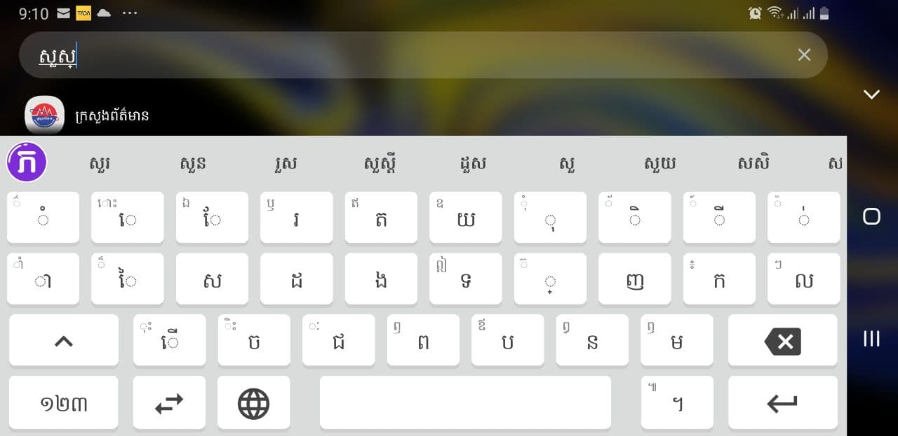
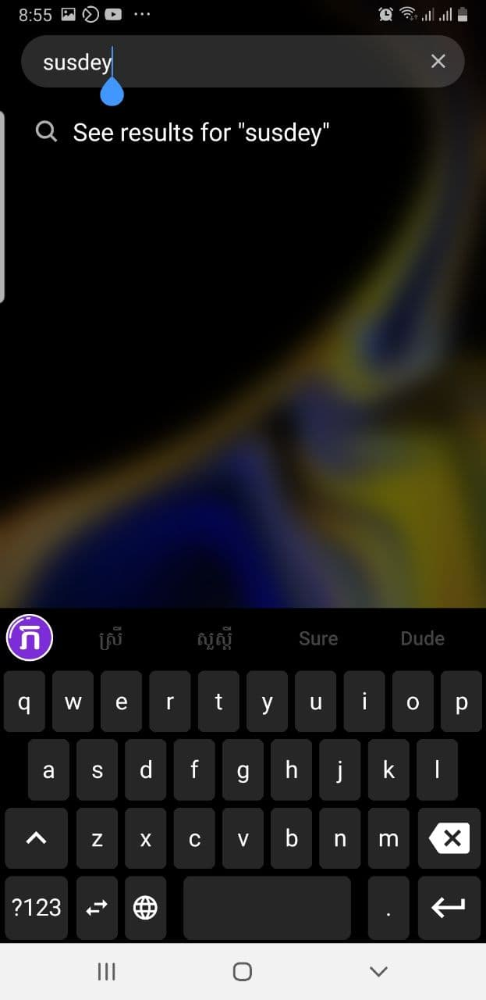

# Khmerlang Keyboard

ការរចនាក្ដារចុចខ្មែរទំនើបសម្រាប់បង្កើនល្បឿនវាយអក្សរជាមួយនឹងការរចនាថ្មី។ ប្លង់ក្ដារចុចថ្មី គាំទ្រភាសារ៉ូម៉ាំងទៅជាភាសាខ្មែរ ជាមួយនឹងការបែងចែកពាក្យដោយស្វ័យប្រវត្តិដោយប្រើការសិក្សាស៊ីជម្រៅ(Deep learning)។

## Features

- New keyboard layout for Khmer(show most type character on first page)
- Spell checker
- Roman to Khmer text
- Local word segmentation(using deep learning TFlite)
- Custom theme colors

Feature it doesn't have and probably will never have:
- Emojis
- GIFs
- Swipe typing

## Images

## Downloads

## Resources

- [Task management](https://trello.com/b/emfEoZt2)

## Licensed

Licensed under MIT

